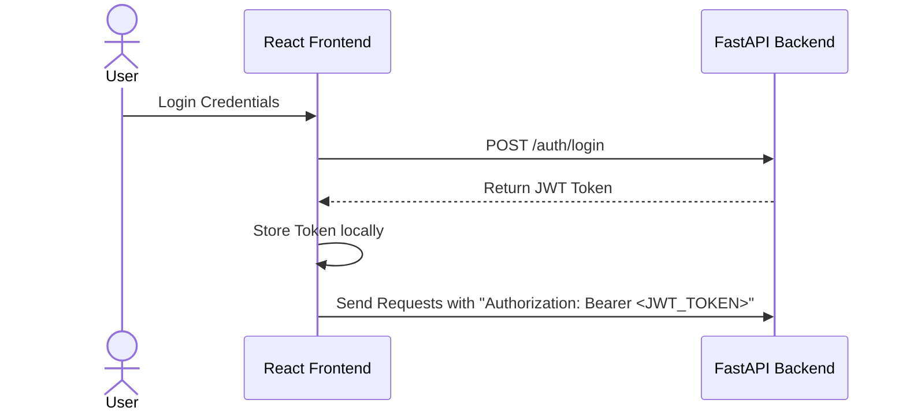

# REST API Design Specification
## SaaS Monitoring Platform

---

## 1. Global Conventions

### 1.1 Base URL
All API requests in this project use the following versioned base path:
```text
https://api.saas-monitor.com/api/v1
```

### 1.2 Content Type
All requests and responses must use the standard format:
```text
Content-Type: application/json
```

### 1.3 Authentication Flow
Protected API endpoints require JSON Web Token (JWT) authorization header:
```http
Authorization: Bearer <JWT_TOKEN>
```



### 1.4 API Versioning
Using explicit path prefix `/api/v1/` shows production design and guarantees future backward compatibility. Endpoints can seamlessly upgrade to `/api/v2/` in parallel phases if needed.

---

## 2. API Endpoints Directory

| Category | Method | Endpoint | Auth Required | Purpose |
| :--- | :--- | :--- | :--- | :--- |
| **Auth** | `POST` | `/api/v1/auth/register` | No | Register a new user |
| **Auth** | `POST` | `/api/v1/auth/login` | No | Authenticate user and receive token |
| **Monitors** | `POST` | `/api/v1/monitors` | **Yes** | Create a new website monitor |
| **Monitors** | `GET` | `/api/v1/monitors` | **Yes** | List all user monitors |
| **Monitors** | `GET` | `/api/v1/monitors/{id}` | **Yes** | Retrieve single monitor details |
| **Monitors** | `PUT` | `/api/v1/monitors/{id}` | **Yes** | Update a monitor's configuration |
| **Monitors** | `DELETE` | `/api/v1/monitors/{id}` | **Yes** | Delete a monitor |
| **Dashboard** | `GET` | `/api/v1/dashboard/summary` | **Yes** | Fetch global uptime & check counts |
| **Dashboard** | `GET` | `/api/v1/dashboard/history/{id}` | **Yes** | Fetch historical check logs for graphs |
| **Alerts** | `GET` | `/api/v1/alerts` | **Yes** | Retrieve active & historical notifications |

---

## 3. Detailed Endpoint Specification

### 3.1 Authentication APIs

#### 3.1.1 Register User
* **Route:** `POST /api/v1/auth/register`
* **Auth:** None
* **Request Payload:**
  ```json
  {
    "email": "veeranna@gmail.com",
    "password": "StrongPassword123"
  }
  ```
* **Response Payload (201 Created):**
  ```json
  {
    "message": "User created successfully"
  }
  ```
* **Status Codes:**
  * `201 Created` - Account created successfully.
  * `400 Bad Request` - Validation error on input fields.
  * `409 Conflict` - Email already exists in the system.

#### 3.1.2 Login User
* **Route:** `POST /api/v1/auth/login`
* **Auth:** None
* **Request Payload:**
  ```json
  {
    "email": "veeranna@gmail.com",
    "password": "StrongPassword123"
  }
  ```
* **Response Payload (200 OK):**
  ```json
  {
    "access_token": "eyJhbGciOiJIUzI1NiIsInR5cCI6IkpXVCJ9...",
    "token_type": "bearer"
  }
  ```
* **Status Codes:**
  * `200 OK` - Login successful, token returned.
  * `401 Unauthorized` - Invalid credentials.

---

### 3.2 Monitor APIs

#### 3.2.1 Create Monitor
* **Route:** `POST /api/v1/monitors`
* **Auth:** Required
* **Request Payload:**
  ```json
  {
    "name": "Portfolio Site",
    "url": "https://veeranna.dev",
    "check_interval": 60
  }
  ```
* **Response Payload (201 Created):**
  ```json
  {
    "id": "e29e0618-c51d-4009-8fba-5c4d092c77d2",
    "name": "Portfolio Site",
    "url": "https://veeranna.dev",
    "status": "active"
  }
  ```

#### 3.2.2 Get All Monitors
* **Route:** `GET /api/v1/monitors`
* **Auth:** Required
* **Response Payload (200 OK):**
  ```json
  [
    {
      "id": "e29e0618-c51d-4009-8fba-5c4d092c77d2",
      "name": "Portfolio Site",
      "url": "https://veeranna.dev"
    }
  ]
  ```

#### 3.2.3 Get Single Monitor
* **Route:** `GET /api/v1/monitors/{monitor_id}`
* **Auth:** Required
* **Response Payload (200 OK):**
  ```json
  {
    "id": "e29e0618-c51d-4009-8fba-5c4d092c77d2",
    "name": "Portfolio Site",
    "url": "https://veeranna.dev",
    "created_at": "2026-06-07T12:00:00Z"
  }
  ```

#### 3.2.4 Update Monitor
* **Route:** `PUT /api/v1/monitors/{monitor_id}`
* **Auth:** Required
* **Request Payload:**
  ```json
  {
    "name": "Updated Portfolio",
    "check_interval": 120
  }
  ```
* **Response Payload (200 OK):**
  ```json
  {
    "id": "e29e0618-c51d-4009-8fba-5c4d092c77d2",
    "name": "Updated Portfolio",
    "url": "https://veeranna.dev",
    "check_interval": 120,
    "status": "active"
  }
  ```

#### 3.2.5 Delete Monitor
* **Route:** `DELETE /api/v1/monitors/{monitor_id}`
* **Auth:** Required
* **Response Payload (200 OK):**
  ```json
  {
    "message": "Monitor deleted"
  }
  ```

---

### 3.3 Dashboard APIs

#### 3.3.1 Dashboard Summary
* **Route:** `GET /api/v1/dashboard/summary`
* **Auth:** Required
* **Response Payload (200 OK):**
  ```json
  {
    "total_monitors": 5,
    "active_monitors": 5,
    "uptime_percentage": 99.8,
    "failed_checks": 3
  }
  ```

#### 3.3.2 Monitor History
* **Route:** `GET /api/v1/dashboard/history/{monitor_id}`
* **Auth:** Required
* **Response Payload (200 OK):**
  ```json
  [
    {
      "status_code": 200,
      "response_time_ms": 245,
      "checked_at": "2026-06-07T12:00:00Z"
    }
  ]
  ```
* *Note: This endpoint provides raw data points designed to render latency history charts on the frontend.*

---

### 3.4 Alert APIs

#### 3.4.1 Get Alerts
* **Route:** `GET /api/v1/alerts`
* **Auth:** Required
* **Response Payload (200 OK):**
  ```json
  [
    {
      "id": "3c847c23-5e74-4b53-8321-bf9260c6d7d4",
      "message": "Website Down - Monitor: Portfolio Site, Time: 10:15 PM, Status: DOWN",
      "created_at": "2026-06-07T12:15:00Z"
    }
  ]
  ```

---

## 4. Input Validation Rules

The backend API strictly validates all inbound request payloads.

| Field | Rule Type | Requirements |
| :--- | :--- | :--- |
| **Email** | Format | Must be a valid email structure (e.g., `user@domain.com`) |
| **URL** | Protocol | Must start with `http://` or `https://` |
| **Check Interval** | Range | Minimum: `60` seconds \| Maximum: `3600` seconds |
| **Password** | Strength | Recommended minimum of 8 characters containing upper/lower case |
