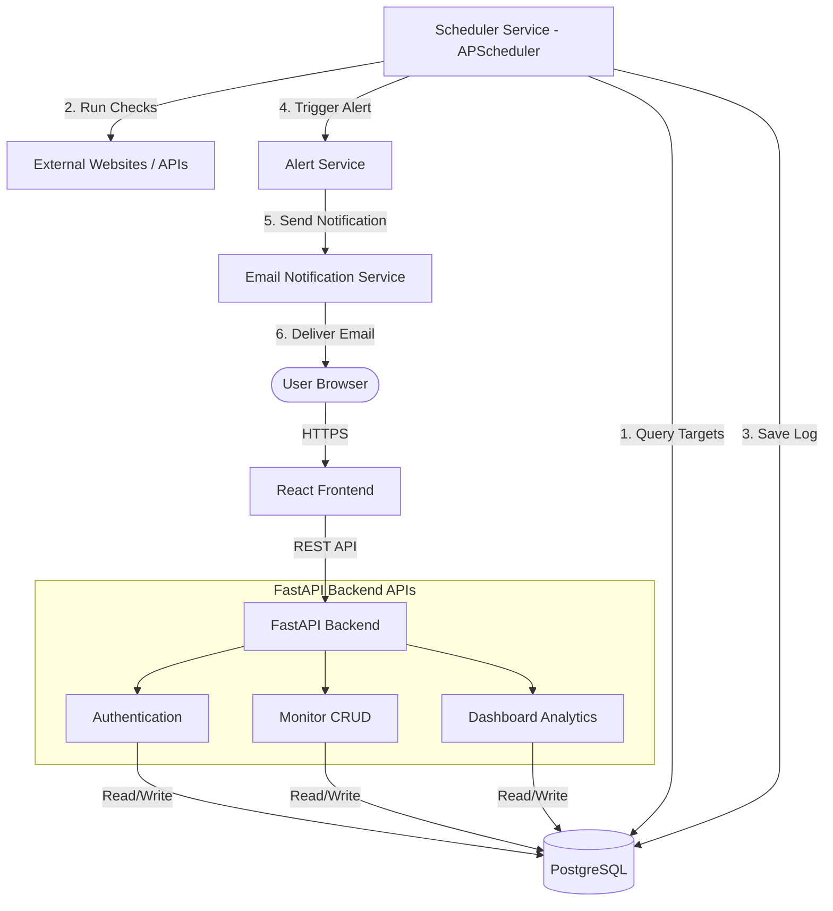
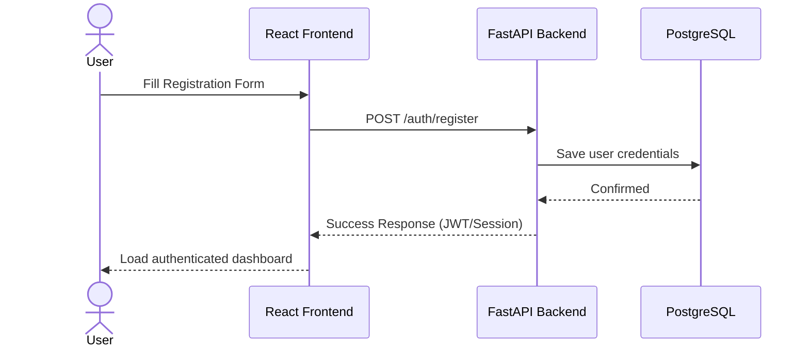
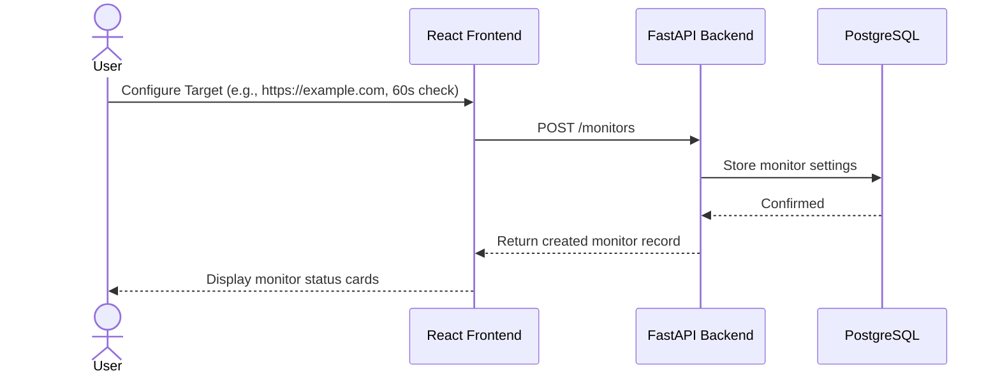
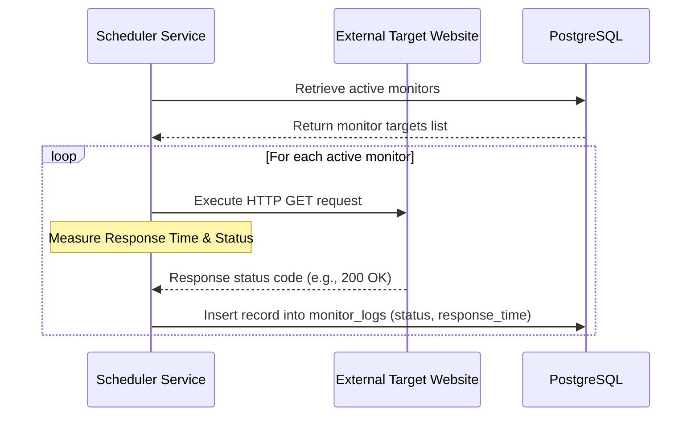
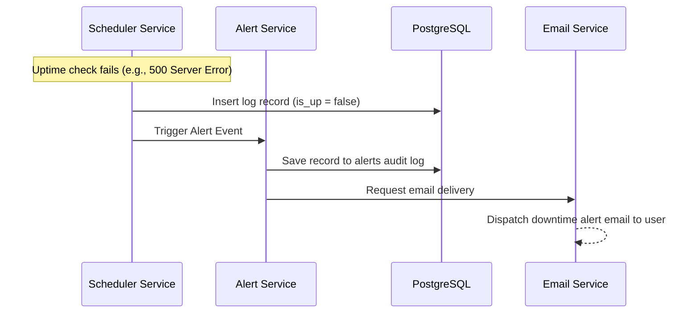
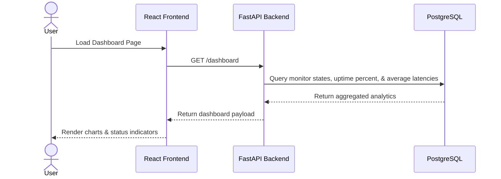

# System Architecture Design
## SaaS Monitoring Platform

---

## 1. Objective & Overview
Define the high-level architecture of the SaaS Monitoring Platform and describe how different system components interact to provide website monitoring, historical analytics, and alert notifications. 

The architecture is designed to be simple and lightweight for the MVP (Version 1) while establishing clear boundaries that support scalability and future horizontal expansion.

---

## 2. System Components

The platform consists of five primary components.

### 2.1 React Frontend
* 💡 **Responsibilities:**
  * User registration and authentication interface.
  * Monitor configuration and CRUD management dashboard.
  * Uptime and response time latency visualization.
  * Historical alert logs and status viewing.
* 🚫 **Constraints:**
  * Communicates exclusively via REST APIs.
  * Has no direct database connectivity.
  * Does not perform monitoring checks or trigger notification emails.

### 2.2 FastAPI Backend
* 💡 **Responsibilities:**
  * User authentication and session validation.
  * Business logic execution and input validation.
  * Database operations (via ORM or query builder).
  * API routing, authorization filters, and schema management.
* 📞 **Key REST APIs:**
  * `POST /auth/register` - Create new user accounts
  * `POST /auth/login` - Obtain authentication tokens
  * `GET /monitors` - Fetch all configured monitors
  * `POST /monitors` - Add a new monitor target
  * `GET /dashboard` - Retrieve aggregated uptime & performance analytics
  * `GET /alerts` - Retrieve historical alerts
* 📌 **Purpose:** Acts as the central application orchestration layer.

### 2.3 PostgreSQL Database
* 💡 **Responsibilities:**
  * Persistent storage for all core business data.
* 🗄️ **Stored Tables:**
  * `users` - Accounts and credentials
  * `monitors` - Websites configuration targets
  * `monitor_logs` - Historical latency and check response logs
  * `alerts` - Records of triggered downtime notifications
* 📌 **Purpose:** Provides durable, relational data integrity and historical auditing.

### 2.4 Scheduler Service
* 💡 **Responsibilities:**
  * Automatically coordinates check loops at configured frequencies.
* 🔄 **Standard Monitoring Workflow:**
  1. Fetch active monitors from PostgreSQL.
  2. Execute concurrency-optimized health checks.
  3. Record status codes, latencies, and availability results.
  4. Write outcome logs to `monitor_logs`.
  5. Check assertions and dispatch alerts if failures occur.
* 📦 **MVP Technology:** `APScheduler` (Advanced Python Scheduler) running in-process or as a lightweight background daemon.
* 🚀 **Future Growth path:** Transition to a distributed setup utilizing a task queue (e.g., Celery, BullMQ) backed by Redis/RabbitMQ and multiple worker processes.

### 2.5 Email Notification Service
* 💡 **Responsibilities:**
  * Deliver downtime/uptime alerts immediately to users when checks fail.
* ✉️ **Alert Format Example:**
  ```text
  Subject: Website Down Alert
  ------------------------------------
  Website: https://example.com
  Status:  DOWN
  Time:    12:15 PM
  ------------------------------------
  ```
* 📌 **Purpose:** Delivers proactive user alerting to guarantee minimal time-to-resolution.

---

## 3. High-Level Architecture Diagram



---

## 4. System Data Flows

### 4.1 User Registration Flow


### 4.2 Create Monitor Target Flow


### 4.3 Automated Uptime Check Flow


### 4.4 Downtime Detection & Alerting Flow


### 4.5 Dashboard Visualization Flow


---

## 5. Scalability Considerations

| Aspect | MVP Architecture (V1) | Production/Scalable Architecture |
| :--- | :--- | :--- |
| **Engine** | FastAPI + SQLite/PostgreSQL + APScheduler | FastAPI + PostgreSQL + Task Queue |
| **Concurrency** | In-process Threading / Async loops | Distributed workers (Celery/BullMQ) with Redis broker |
| **Performance** | Ideal for 100s of monitored targets | Scales horizontally to 10,000s of parallel targets |
| **Fault Tolerance** | Single process failure stops scheduling | Workers can fail independently without halting scheduling |

---

## 6. Architectural Principles

* 📐 **Separation of Concerns:** Each component is decoupled. The frontend handles view presentation; the backend processes business logic; the scheduler runs checks independently; and the database manages state.
* ⚙️ **Horizontal Scalability:** Components can be scaled separately. If check counts grow, additional workers can be added. If browser traffic spikes, frontend/API instances can be replicated.
* 🛠️ **Maintainability:** Clear boundaries and interface contracts make debugging, updating dependencies, and building integrations trivial.

---

## 7. Summary
The SaaS Monitoring Platform uses a layered architecture consisting of a React frontend, FastAPI backend, PostgreSQL database, scheduler service, and email notification system. 

By separating API logic from scheduled task runners, the system maintains high responsive performance on user dashboard requests while executing continuous, reliable background health checks. This template serves as a strong foundation for future features including API monitoring assertions, distributed worker nodes, Slack hook notifications, and multi-tenant billing models.
