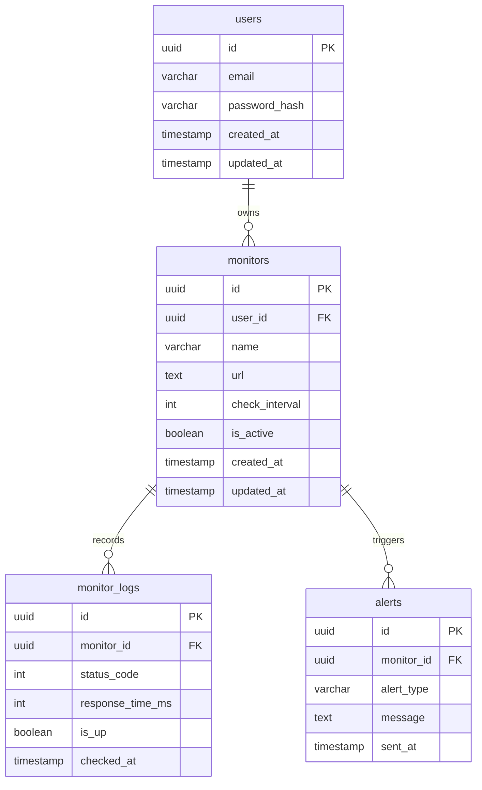

# Database Design Specification
## SaaS Monitoring Platform

---

## 1. Objective
Design the database schema required to support the MVP of the SaaS Monitoring Platform. The database is designed to store user information, website monitors, monitoring results, and alert history. 

This design focuses on simplicity for the MVP (Version 1) while ensuring clean data integrity and extensibility for future features (e.g., API monitoring, team workspaces, multi-region monitoring).

---

## 2. Business Entities & Schema DDL

The MVP database consists of four core tables.

### 2.1 User (`users`)
Represents a registered user on the platform. Used for authentication and monitor ownership.

| Column | Type | Constraints | Description |
| :--- | :--- | :--- | :--- |
| `id` | UUID | Primary Key, DEFAULT `gen_random_uuid()` | Unique identifier for each user |
| `email` | VARCHAR(255) | Unique, Not Null | User's email address |
| `password_hash` | VARCHAR(255) | Not Null | Hashed password credentials |
| `created_at` | TIMESTAMP | DEFAULT `CURRENT_TIMESTAMP` | Record creation time |
| `updated_at` | TIMESTAMP | DEFAULT `CURRENT_TIMESTAMP` | Last update time |

---

### 2.2 Monitor (`monitors`)
Represents a website or API endpoint configured by a user for availability tracking.

| Column | Type | Constraints | Description |
| :--- | :--- | :--- | :--- |
| `id` | UUID | Primary Key, DEFAULT `gen_random_uuid()` | Unique identifier for the monitor |
| `user_id` | UUID | Foreign Key (`users.id`), ON DELETE CASCADE | Reference to the owner of the monitor |
| `name` | VARCHAR(255) | Not Null | A friendly name for the monitor (e.g., `Portfolio Website`) |
| `url` | TEXT | Not Null | The website/API URL to monitor (e.g., `https://veeranna.dev`) |
| `check_interval` | INTEGER | DEFAULT 60 | Uptime check frequency in seconds |
| `is_active` | BOOLEAN | DEFAULT TRUE | Uptime check enablement state |
| `created_at` | TIMESTAMP | DEFAULT `CURRENT_TIMESTAMP` | Record creation time |
| `updated_at` | TIMESTAMP | DEFAULT `CURRENT_TIMESTAMP` | Last update time |

---

### 2.3 Monitor Log (`monitor_logs`)
Stores results generated by every individual uptime/performance check.

| Column | Type | Constraints | Description |
| :--- | :--- | :--- | :--- |
| `id` | UUID | Primary Key, DEFAULT `gen_random_uuid()` | Unique identifier for the log entry |
| `monitor_id` | UUID | Foreign Key (`monitors.id`), ON DELETE CASCADE | Reference to the related monitor |
| `status_code` | INTEGER | Nullable | HTTP status code returned (e.g., `200`, `500`) |
| `response_time_ms` | INTEGER | Not Null | Latency of the network request in milliseconds |
| `is_up` | BOOLEAN | Not Null | Availability state calculated from check (UP / DOWN) |
| `checked_at` | TIMESTAMP | DEFAULT `CURRENT_TIMESTAMP` | Timestamp of the monitor check |

* **Example log states:**
  * **UP:** Status Code: `200` | Response Time: `245 ms` | Status: `is_up = true`
  * **DOWN:** Status Code: `500` | Response Time: `120 ms` | Status: `is_up = false`

---

### 2.4 Alert (`alerts`)
Logs all notifications dispatched when downtime is detected.

| Column | Type | Constraints | Description |
| :--- | :--- | :--- | :--- |
| `id` | UUID | Primary Key, DEFAULT `gen_random_uuid()` | Unique identifier for the alert |
| `monitor_id` | UUID | Foreign Key (`monitors.id`), ON DELETE CASCADE | Reference to the affected monitor |
| `alert_type` | VARCHAR(50) | Not Null | Type of notification channel/alert (e.g., `EMAIL`) |
| `message` | TEXT | Not Null | Detailed message regarding status change |
| `sent_at` | TIMESTAMP | DEFAULT `CURRENT_TIMESTAMP` | Timestamp when the alert was dispatched |

* **Example Alert Entry:**
  * **Type:** `EMAIL`
  * **Message:** `Website Down - Monitor: Portfolio Website, Time: 10:15 PM, Status: DOWN`

---

## 3. Entity Relationships

### 3.1 Logical Relationships
* **User ➔ Monitor:** One user can own multiple website monitors (1-to-many relationship).
* **Monitor ➔ Monitor Logs:** One monitor generates many heartbeat logs over time (1-to-many relationship).
* **Monitor ➔ Alerts:** One monitor can trigger multiple downtime alerts over its lifecycle (1-to-many relationship).

### 3.2 Entity-Relationship Diagram (ERD)

---

## 4. Key Design Decisions

### 4.1 UUID as Primary Key
All tables use **UUID v4** instead of auto-incrementing integer IDs.
* **Benefits:**
  * Globally unique keys prevent collisions during migrations or distributed scaling.
  * Better security by avoiding predictable sequential resource IDs (prevents ID enumeration attacks).
  * Easier preparation for multi-tenant database architectures.

### 4.2 Standard Timestamp Columns
Each business-logic table (`users`, `monitors`) includes standard auditing fields: `created_at` and `updated_at`.
* **Benefits:**
  * Clean operational auditing.
  * Robust sorting, querying, and record tracking.
  * Facilitates easier troubleshooting and analytics reporting.

### 4.3 Data Integrity via Foreign Key Constraints
Referential integrity is strictly enforced at the database layer.
* **Examples:**
  * `monitors.user_id` ➔ `users.id` (with cascade delete: if a user is deleted, their monitors are removed).
  * `monitor_logs.monitor_id` ➔ `monitors.id` (with cascade delete to prevent orphaned logs).
  * `alerts.monitor_id` ➔ `monitors.id` (with cascade delete to clean up related alerts).

---

## 5. Summary & Future Extensibility
The MVP schema comprises 4 high-integrity tables that securely support user authentication, customizable website frequency configurations, historical performance logging, and downtime alert histories.

While designed to be simple for Version 1, this base is highly extensible to support future requirements such as multi-channel integrations (e.g., Slack, Webhooks), team workspaces (by inserting a `workspace_id` relation), custom alert thresholds, and aggregated uptime analytics.
